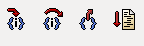

# Les bases du débogage

Avant d'ouvrir le programme avec un débugger, lancez-le pour voir s'il attend des paramètres et avoir un premier aperçu de son fonctionnment normal.

Maintenant qu'on a une meilleure compréhension du programme, on peut l'ouvrir avec son débogueur préféré. Par la suite j'utiliserai un débogueur graphique pour Linux qui s'appelle EDB. Si vous souhaitez l'installer, suivez [le guide d'installation](..Documentation/install%20EDB.md). Il est également possible d'utiliser GDB qui est très puissant mais entièrement en ligne de commande, ce qui est moins attirant pour les débutants.

## Déboguer avec EDB

Débogage d'un programme sans passage d'arguments:

`edb --run <prog>`

Débogage d'un programme nécessitant 2 arguments:

`edb --run <prog> <arg1> <arg2>`

A l'ouverture, on ne se trouve pas encore au début de la fonction _main()_. La première chose à faire est de s'y rendre. Pour cela, exécutez simplement toutes les instructions sans vous soucier de ce qu'elles font jusqu'à l'appel à la fonction ___libc_start_main()_. 

Utiliser les boutons en haut à gauche, ils devraient ressembler à ceux-là:

- Le bouton le plus à gauche entre dans les appels de fonctions pour pouvoir déboguer plus en profondeur.
- Le deuxième exécute une instruction sans entrer dans les appels de fonctions.
- Le troisième permet d'exécuter toutes les instructions jusqu'à sortir de la fonction courante.
- Le dernier exécute l'ensemble du programme.

On utilisera seulement le deuxième et parfois le premier, lorsque l'on souhaite aller voir des fonctions particulières.

Exécutez la fonction ___libc_start_main()_ sans entrer dedans (deuxième bouton) et vous allez vous retrouver au début de la fonction _main()_.

## Rappels d'assembleur:

Maintenant que le programme est chargé dans un débogueur, il est important d'avoir quelques notions d'assembleur (x86).

- le registre EIP indique la prochaine instruction à executer

Un debugger permet de le modifier et donc de changer le flux d'execution du programme à votre guise. Utilisez cette technique pour éviter les pièges que l'on vous tend.

- Après un appel à une fonction qui renvoie une valeur (strlen, rand, ...), celle-ci se trouvera dans EAX.

Modifier les valeurs de retour de certaines fonctions est indispensable pour contourner certaines protections.

- Les instructions de saut conditionnels se basent sur le registre de flag.

Changer les flags depuis le débogueur permet prendre ou non un saut conditionnel. Chaque instruction se base sur des flags différents, il ne faut pas hésiter à se renseigner en cas de doute.

## Se repérer

Une fois dans un débogueur on peut être vite perdu. Comprendre le programme depuis un débogueur est plus compliqué qu'en lisant le code source mais voici quelques conseils pour vous y retrouver :

- Voir quelles fonctions sont appellée où et quand permet de se faire une idée plus visuelle de se qui se passe et de trouver les bout de codes à éviter/appeller.

Il n'est pas nécessaire de comprendre chaque instruction individuellement dès le début. Contentez-vous de regarder les appels de fonction et les chaines de caractères qui sont affichées.

- Focalisez-vous sur les saut conditionnels.

En regardant la destination d'un saut conditionnel on peut en déduire si on doit ou non le prendre et donc d'adapter nos paramètres. Par example, si vous voyez qu'un saut vous dirige vers un bout de code qui affiche un message d'erreur, dans le cas d'une condition vraie, il vaudrai mieux faire en sorte que la condition soit fausse.

- Entrez dans les fonctions qui ne sont pas des fonctions de la libc.

En entrant dans les fonctions codées par le programmeur vous comprendrez mieux le fonctionnement global. Si vous ne le faite pas, vous risquez de manquer pas mal de choses. Si vous ne savez pas si une fonction est une fonction de la libc ou pas, une recherche sur Internet devrai vite lever le doute.

### Exercices

[Ex4](../Exercices/Ex4), [Ex3](../Exercices/Ex3)